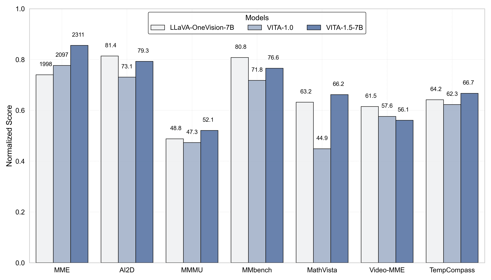
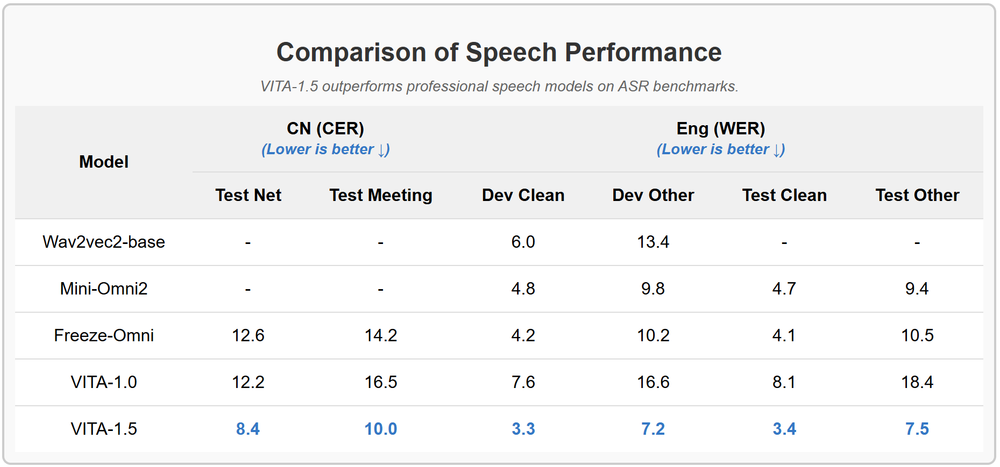
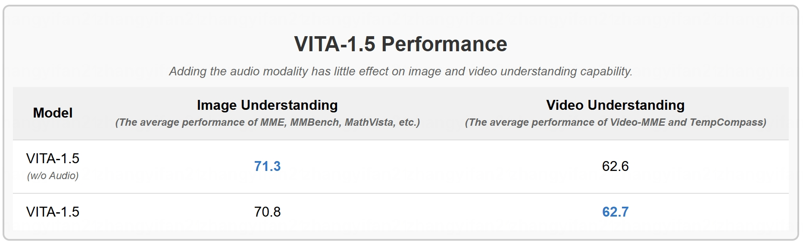

# VITA-RL: Extending VITA-1.5 with Reinforcement Learning

> [!IMPORTANT]
> **This is not the official VITA repository.**
>
> This project is a fork of and an extension to [**VITA-MLLM/VITA**](https://github.com/VITA-MLLM/VITA)
> (VITA-1.5: *Towards GPT-4o Level Real-Time Vision and Speech Interaction*).
>
> - **Upstream repository**: https://github.com/VITA-MLLM/VITA
> - **Baseline commit**: [`35d064a`](https://github.com/VITA-MLLM/VITA/commit/35d064a6542a5d812136fcd66fa93d9beb27b03c) (2025-03-28)
> - **Upstream paper**: [VITA-1.5 (arXiv:2501.01957)](https://arxiv.org/pdf/2501.01957)
>
> All model architecture, training recipes, benchmark numbers, and pretrained weights
> described below are the work of the original **VITA team (Tencent Youtu Lab et al.)**.
> This repository adds no claim over them. Please cite the
> [original papers](#️-citation) and respect the [original license](./License.txt),
> which restricts use to **academic, research and educational purposes only**.

> Language: **English** | [中文](./README_zh-CN.md)

<p align="center">
    
</p>

<font size=7><div align='center' > [[📖 VITA-1.5 Paper](https://arxiv.org/pdf/2501.01957)] [[🏠 Upstream Repo](https://github.com/VITA-MLLM/VITA)] [[🤖 Basic Demo](https://modelscope.cn/studios/modelscope/VITA1.5_demo)] [[🍎 VITA-1.0](https://vita-home.github.io/)]</div></font>

---

## 🎯 About This Fork

The goal of this repository is to **reproduce VITA-1.5 end-to-end**, and then to
**extend it with a reinforcement learning stage**, which upstream does not provide
(the original codebase contains only supervised fine-tuning).

> **Scope note.** This fork's RL work targets the **text + image/video**
> modalities only. VITA-1.5's audio encoder is kept as a frozen component
> throughout (it ships with the checkpoint and inference still supports it),
> but no audio training or audio RL happens here.

### Roadmap

| Stage | Status | Description |
|---|---|---|
| 1. Reproduce inference | ✅ Done | Text, audio and noisy-audio queries all run against the released VITA-1.5 checkpoint |
| 2. Verify training pipeline | ✅ Done | Runs end to end on 8×H800 with a synthetic dataset; checkpoints save and reload |
| 3. Benchmark baseline | ✅ Done | **MME 2353.5, MMStar 59.8, MMBench 77.8, AI2D 79.2 — all within 1.2 points of the paper.** See [BENCHMARKS.md §2.6](./BENCHMARKS.md) |
| 4. Train on real data | ✅ Done | 3000 RLAIF-V preference pairs, one epoch of LoRA DPO, first-step loss exactly `-log(0.5)` |
| 5. Add RL | ✅ Done | DPO: POPE hallucination 10.97% → 8.82% (McNemar p<1e-4) via SFT-then-DPO — see [EXPERIMENT_LOG.md](./EXPERIMENT_LOG.md). GRPO: multimodal extension trained on CLEVR counting with a verifiable reward, **held-out accuracy 44.6% → 77.4% in 400 steps** (win rate 0.977) — see [GRPO_DEEP_DIVE.md](./GRPO_DEEP_DIVE.md) |

**Read [EXPERIMENT_LOG.md](./EXPERIMENT_LOG.md) for the whole story of stages 3-5**:
three rounds of DPO on RLAIF-V, none of which moved the benchmarks beyond
noise, with the reason measured rather than guessed — the base model separates
those preference pairs at 53.6% (95% CI [50.3%, 56.8%], n=900), a
signal-to-noise ratio of 0.055–0.11. Raising the effective batch from 16 to 63
made DPO genuinely learn on this data (loss below 0.69, 18x the reward margin)
and the benchmarks still did not improve — POPE changed 24 of 5127 answers,
12 fixed against 12 broken. `tools/probe_preference_separability.py` predicts
this in eight minutes, before the four hours behind it. The endgame is
SFT-then-DPO (POPE hallucination 10.97% → 8.82%).

**Read [GRPO_DEEP_DIVE.md](./GRPO_DEEP_DIVE.md) for the GRPO arc**: the same
lesson in a different costume. Two rounds on RLAIF-V with proxy rewards
(keyword overlap, LLM judge) moved the KL 6x without moving any content
reward — within a group of 8 open-ended descriptions, proxy scores rank
stylistic luck, so the group-normalised advantage was ranking noise.
Switching to a verifiable reward (CLEVR counting, binary exact-match) made
the curve take off: held-out accuracy 44.6% → 77.4% in 400 steps.

**New to this codebase?** Start with [PRIMER.md](./PRIMER.md) — the background
you need before the other documents make sense: the negative-index placeholder
mechanism, measured token budgets, the three encoders, and the traps that cost
the most time. Its [reading order](./PRIMER.md#12-建议的阅读顺序) lays out a
four-stage path through the code, with timings and which parts need a GPU.

### Which document to read when

| Document | Read it when | Language |
|---|---|---|
| [PRIMER.md](./PRIMER.md) | **First.** Prerequisites for everything else | 中文 |
| [HANDBOOK.md](./HANDBOOK.md) | You are at a terminal: commands, landmines, troubleshooting | 中文 |
| [ARCHITECTURE.md](./ARCHITECTURE.md) | You want to know why a piece of code is the way it is | EN + [中文](./ARCHITECTURE_zh-CN.md) |
| [REPRODUCE.md](./REPRODUCE.md) | Setting up the environment | EN + [中文](./REPRODUCE_zh-CN.md) |
| [DATASETS.md](./DATASETS.md) | Ready to train on real data | 中文 |
| [MIGRATION.md](./MIGRATION.md) | Moving to another machine | EN + [中文](./MIGRATION_zh-CN.md) |
| [CODEMAP.md](./CODEMAP.md) | Reading on GitHub and want to jump straight to a function | 中文 |
| [BENCHMARKS.md](./BENCHMARKS.md) | You need the measured numbers: timings, memory, the reproducible loss values to check a change against | 中文 |
| [EXPERIMENT_LOG.md](./EXPERIMENT_LOG.md) | **The DPO experiment end to end**: design, every number, why it came out the way it did, and the wrong turns | 中文 |
| [SFT_DPO_DEEP_DIVE.md](./SFT_DPO_DEEP_DIVE.md) | Code-level deep dive of the SFT + DPO pipeline: mechanisms, memory math, on/off-policy | 中文 |
| [GRPO_DEEP_DIVE.md](./GRPO_DEEP_DIVE.md) | **The GRPO experiment end to end**: math details, hyperparameters, reward design, metric handbook, four training rounds (proxy-reward failure → verifiable-reward +32.8pt), interview Q&A | 中文 |
| [RESULTS.md](./RESULTS.md) | An earlier, narrower write-up of the same experiment; superseded by the above | 中文 |

The two walkthroughs worth knowing about: [ARCHITECTURE.md
§5](./ARCHITECTURE.md#5-prepare_inputs_labels_for_multimodal-the-heart-of-the-model)
dissects the function that makes this model work, and [§14](./ARCHITECTURE.md#14-the-rl-stack-dpo-and-grpo)
covers the RL stack this fork added.

See [REPRODUCE.md](./REPRODUCE.md) for the full log: working dependency set,
the code fixes required, and how to run the training smoke test. See
[ARCHITECTURE.md](./ARCHITECTURE.md) for how the model and codebase actually
work — the modality-fusion mechanism, the three encoders, the inference and
training paths, and how the RL stack (DPO + GRPO) attaches. See
[DATASETS.md](./DATASETS.md) for the training-data survey: what the paper used,
what is still downloadable as of August 2026, and three plans sized to
available disk.

### Reproducing this

The upstream install and quick-start instructions further down do not work
as written on every machine (see [REPRODUCE.md](./REPRODUCE.md) for why).
Start here instead:

```bash
export VITA_REPO=$(pwd) VITA_WEIGHTS=/path/to/weights   # ~25 GB free
conda create -n vita python=3.10 -y && conda activate vita
# staged dependency install: REPRODUCE.md#install-order-order-matters
# weights + config localization: REPRODUCE.md#weights
python tools/localize_config.py \
    --model-path "$VITA_WEIGHTS/VITA-1.5" \
    --vision-tower "$VITA_WEIGHTS/InternViT-300M-448px"
```

Exact resolved versions are in
[`requirements-lock.txt`](./requirements-lock.txt) — read it as a record of a
known-good set, not as an install path.

Rebuilding on a fresh machine? See [MIGRATION.md](./MIGRATION.md) — git holds
only code (~11 MB); the weights and conda environment must be re-acquired.

### Changes relative to upstream

- Added a `.gitignore` (upstream has none) covering training outputs, model weights and secrets.
- Rewrote this README to attribute the work to the upstream project and to document the fork's goals.
- **Fixed `cache_position` under the pinned `transformers==4.41.1`** — upstream's
  `vita_qwen2.py` cannot generate on the version its own `requirements.txt`
  pins. See [REPRODUCE.md](./REPRODUCE.md#code-fixes-required).
- **Added the missing `DataConfig` keys** (`Pretrain_video0`, `Pretrain_audio`)
  that several upstream training scripts pass but that were never defined.
- **Made `audios` optional in `prepare_inputs_labels_for_multimodal`** — the
  `None` branch existed but was unreachable, so every text-only or image-only
  forward pass had to be fed a dummy waveform and ran the 341M-parameter audio
  encoder for nothing. See [ARCHITECTURE.md](./ARCHITECTURE.md#12-known-defects-and-rough-edges).
- **Added GRPO** on top of DPO: the policy samples its own completions and a
  pluggable reward scores them during training, with the group as the
  baseline instead of a critic. `vita/train/{rewards,grpo_loss,grpo_data,grpo_trainer}.py`
  and `train_grpo.py`, plus `tools/test_grpo_loss.py` (39 checks) and
  `tools/test_rewards.py` (44 checks). Extended from text-only to
  **image+text** (vision features are fused into the prompt embeddings once,
  then reused by all G rollouts), with PPO-style sample reuse
  (`--grpo_num_iterations`) and verifiable rewards (`answer` exact match +
  graded `format`). Trained for real on CLEVR counting:
  `tools/make_clevr_grpo_data.py`, `script/train/grpo_clevr.sh`,
  `tools/eval_grpo_heldout.py` — held-out accuracy 44.6% → 77.4% in 400
  steps. See [GRPO_DEEP_DIVE.md](./GRPO_DEEP_DIVE.md) and
  [HANDBOOK.md §9](./HANDBOOK.md#9-grpo组相对策略优化).
- **Added offline DPO**, the first RL-family objective in this codebase
  (upstream has only SFT). `vita/train/dpo_{loss,data,trainer}.py` and
  `train_dpo.py`, with `tools/test_dpo_loss.py` (19 CPU checks) and
  `script/train/dpo_smoke_test.sh`. The reference policy is the same weights
  with the LoRA adapter disabled, so it costs no extra memory. See
  [HANDBOOK.md §8](./HANDBOOK.md#8-dpo离线偏好优化).
- Added `encode_images_deduped` to `vita_arch.py`: when a batch repeats the
  same media across sequences (DPO's chosen/rejected pair, later GRPO's
  rollout group), the vision tower encodes one repetition and the features
  are tiled. Bit-identical, asserted with `torch.equal` in
  `tools/test_image_dedup.py`; 44-46% off the vision-tower forward. Opt-in
  via `image_group_size`, so SFT is untouched.
- Generalised `train()` in `vita/train/train.py` to accept optional
  argument-class, data-module and trainer factories, so DPO reuses the ~230
  lines of model construction instead of copying them. Calling it with no
  arguments behaves exactly as before.
- **Made LoRA usable.** `find_all_linear_names` did not exclude
  `audio_encoder`, and whale contains two `nn.Linear`s whose leaf name is the
  digit `"0"`; peft matches by suffix, so that matched `layers.0` — a whole
  `Qwen2DecoderLayer` — and `--lora_enable True` always failed. Excluded
  `audio_encoder` and skipped numeric leaf names. Single-GPU LoRA now peaks
  at 23.3 GB.
- Added `script/train/smoke_test_lora.sh`, the first script that exercises
  the LoRA path.
- Added `tools/make_smoke_data.py` and `script/train/smoke_test_qwen.sh`, a
  synthetic-data smoke test for the training pipeline.
- Added `tools/test_audio_optional.py`, a CPU unit test for the fix above
  (stubbed encoders, no weights needed).
- Added `tools/inspect_dataset.py`, which loads a configured dataset on CPU
  and reports sequence lengths, which span is supervised, collated shapes,
  and how many samples had their labels silently voided — run it after
  wiring up a dataset and before spending GPUs on it.
- Added `tools/localize_config.py`, which rewrites the checkpoint's
  `mm_vision_tower` / `mm_audio_encoder` from HuggingFace repo IDs to local
  paths so that loading does not require network access.
- Added `PRIMER.md` (prerequisite knowledge), `HANDBOOK.md` (hands-on guide),
  `REPRODUCE.md` (operational log),
  `ARCHITECTURE.md` (code walkthrough), `DATASETS.md` (training-data survey),
  `EXPERIMENT_LOG.md` (the DPO six-round record),
  `GRPO_DEEP_DIVE.md` (the GRPO four-round record and deep dive),
  `SFT_DPO_DEEP_DIVE.md`, `PROJECT_SUMMARY.md`
  and `requirements-lock.txt`.

Any further deviation from upstream will be recorded in this section.

> **Note on reproduction.** The upstream scripts contain hard-coded absolute paths from the
> original authors' cluster (`/mnt/cfs/lhj/...`), hard-coded multi-node addresses, and an
> empty dataset registry. These must be adapted locally before anything will run — see
> [Reproduction Notes](#-reproduction-notes).

---

<p align="center">
    
</p>

<font size=7><div align='center' > [[📽 VITA-1.5 Demo Show 🔥](https://youtu.be/tyi6SVFT5mM?si=fkMQCrwa5fVnmEe7)] </div></font>  
<font size=7><div align='center' > VITA-1.5 supports both **English** and **Chinese**.🌟 </div></font>  
You can try the upstream [Basic Demo](https://modelscope.cn/studios/modelscope/VITA1.5_demo) on ModelScope directly. The Real-Time Interactive Demo needs to be configured according to the [instructions](#-real-time-interactive-demo).

## 🔥 Upstream News

*The following milestones are from the original VITA project.*

* **`2025.01.17`** 🌟 ModelScope has supported VITA-1.5! You can try the [Basic Demo](https://modelscope.cn/studios/modelscope/VITA1.5_demo) on it!
* **`2025.01.06`** 🌟 [VLMEvalKit](https://github.com/open-compass/VLMEvalKit) of OpenCompass has supported both VITA-1.5 and VITA-1.0 models!
* **`2025.01.06`** 🌟 The [technical report](https://huggingface.co/VITA-MLLM) of VITA-1.5 has been released!
* **`2024.12.20`** 🌟 The VITA team introduced **VITA-1.5**, a more powerful and more real-time version!
* **`2024.08.12`** 🌟 The VITA team launched **VITA-1.0**, the first-ever open-source interactive omni multimodal LLM!


## Contents <!-- omit in toc -->

- [VITA-RL: Extending VITA-1.5 with Reinforcement Learning](#vita-rl-extending-vita-15-with-reinforcement-learning)
  - [🎯 About This Fork](#-about-this-fork)
  - [🔥 Upstream News](#-upstream-news)
  - [👀 VITA-1.5 Overview](#-vita-15-overview)
    - [🌟 What’s New in VITA-1.5?](#-whats-new-in-vita-15)
  - [📈 Experimental Results](#-experimental-results)
  - [🛠 Reproduction Notes](#-reproduction-notes)
  - [⭐ Training](#-training)
    - [Requirements and Installation](#requirements-and-installation)
    - [Data Preparation](#data-preparation)
    - [Continual Training](#continual-training)
  - [📐 Inference](#-inference)
    - [Quick Start](#quick-start)
    - [Demo](#demo)
      - [📍 Basic Demo](#-basic-demo)
      - [📍 Real-Time Interactive Demo](#-real-time-interactive-demo)
  - [📏Evaluating on MLLM Benchmarks](#evaluating-on-mllm-benchmarks)
    - [VLMEvalKit](#vlmevalkit)
    - [Video-MME](#video-mme)
      - [Data Preparation](#data-preparation-1)
      - [Evaluation](#evaluation)
  - [✒️ Citation](#️-citation)
  - [📣 Statement](#-statement)
  - [📜 Related Works](#-related-works)
  - [👍 Acknowledgement](#-acknowledgement)


## 👀 VITA-1.5 Overview

*This section describes the upstream model. All results below are reported by the original authors.*

On 2024.08.12, the VITA team launched **VITA-1.0**, the **first-ever open-source interactive omni-multimodal LLM**. On 2024.12.20, they released **VITA-1.5**.

### 🌟 What’s New in VITA-1.5?

**VITA-1.5** incorporates a series of advancements:

1. **Significantly Reduced Interaction Latency**. The end-to-end speech interaction latency has been reduced from about **4 seconds** to **1.5 seconds**, enabling near-instant interaction and greatly improving user experience.  

2. **Enhanced Multimodal Performance**.  The average performance on multimodal benchmarks such as *MME*, *MMBench*, and *MathVista* has been significantly increased from **59.8** to **70.8**.

3. **Improvement in Speech Processing**. The speech processing capabilities have been refined to a new level, with ASR WER (Word Error Rate, Test Other) reduced from **18.4** to **7.5**. Besides, we replace the independent TTS module of VITA-1.0 with an **end-to-end TTS module**, which accepts the LLM's embedding as input.  

4. **Progressive Training Strategy**. By this manner, the adding of speech has little effect on other multi-modal performance (vision-language). The average image understanding performance only drops from 71.3 to 70.8.


## 📈 Experimental Results

*All numbers below are reported by the upstream VITA team in the [VITA-1.5 paper](https://arxiv.org/pdf/2501.01957). This fork's own measurements live elsewhere: the re-measured baseline (MME 2353.5, MMStar 59.8, MMBench 77.8, AI2D 79.2 — all within 1.2 points of the paper) in [BENCHMARKS.md §2.6](./BENCHMARKS.md), the DPO results in [EXPERIMENT_LOG.md](./EXPERIMENT_LOG.md), and the GRPO results in [GRPO_DEEP_DIVE.md](./GRPO_DEEP_DIVE.md).*

- **Evaluation on image and video understanding benchmarks.**

<p align="center">
    
</p>

- **VITA-1.5 outperforms professional speech models on ASR benchmarks.**

<p align="center">
    
</p>

- **Adding the audio modality has little effect on image and video understanding capability**.

<p align="center">
    
</p>

## 🛠 Reproduction Notes

*This section is specific to this fork and is not part of the upstream README.*

The upstream code was released as-is from the authors' internal cluster. The following
must be adapted before anything will run — none of these are bugs, they are simply
environment-specific values that were never parameterised:

1. **Hard-coded absolute paths.** Every script under `script/train/` references
   `/mnt/cfs/lhj/...`, `/mnt/cfs2/lhj/...` or `/mnt/shared/data1/lhj/...` for model
   weights and outputs. `GLOBAL_WEIGHTS_PATH` in
   [`vita/constants.py`](./vita/constants.py) is still the placeholder
   `/path/to/model_weights`.

2. **Hard-coded multi-node settings.** The `*_nodes.sh` scripts pin `INDEX` (node rank)
   and `MASTER_ADDR` to the authors' cluster, e.g. `INDEX=3` and
   `MASTER_ADDR="10.206.0.199"` in `finetuneTaskNeg_qwen_nodes.sh`. Each node needs a
   distinct `INDEX`. NCCL variables (`NCCL_SOCKET_IFNAME=eth0`, `NCCL_IB_GID_INDEX=3`)
   assume a specific interconnect.

3. **Empty dataset registry.** [`vita/config/dataset_config.py`](./vita/config/dataset_config.py)
   ships with empty strings for `AudioFolder`, `FolderDict` and `chat_path`. In addition,
   `DataConfig` in [`vita/config/__init__.py`](./vita/config/__init__.py) only defines the
   key `Pretrain_video`, while several scripts pass `--dataset_use Pretrain_video0` or
   `Pretrain_audio`; those keys must be added or the run fails with a `KeyError`.

4. **The data pipeline is selected in source, not on the CLI.** `train.py` imports one of
   seven `data_utils_*` variants via commented-out import lines near the top of
   [`vita/train/train.py`](./vita/train/train.py). The default (`..._neg_patch`) matches
   the documented continual-training recipe.

5. **Pinned, older dependencies.** `torch==2.3.1` and `transformers==4.41.1`.
   `vita/model/language_model/vita_qwen2.py` monkey-patches `Qwen2ForCausalLM.forward`,
   which couples it tightly to that `transformers` version — upgrading is likely to break it.

6. **`command.sh` is not a build script.** It is the original authors' scratch command
   history and references files that no longer exist in the repository. Do not use it as
   an entry point.

## ⭐ Training

*The recipe below is the upstream training procedure, reproduced here for convenience.*

### Requirements and Installation
```
git clone https://github.com/eternity-blog/VITA-RL
cd VITA-RL
conda create -n vita python=3.10 -y
conda activate vita
pip install --upgrade pip
pip install -r requirements.txt
pip install flash-attn --no-build-isolation
```

### Data Preparation
- An example json file of the training data:
```
[
    ...
    {
        "set": "sharegpt4",
        "id": "000000000164",
        "conversations": [
            {
                "from": "human",
                "value": "<image>\n<audio>\n"
            },
            {
                "from": "gpt",  // follow the setting of llave, "gpt" is only used to indicate that this is the ground truth of the model output
                "value": "This is a well-organized kitchen with a clean, modern aesthetic. The kitchen features a white countertop against a white wall, creating a bright and airy atmosphere. "
            }
        ],
        "image": "coco/images/train2017/000000000164.jpg",
        "audio": [
            "new_value_dict_0717/output_wavs/f61cf238b7872b4903e1fc15dcb5a50c.wav"
        ]
    },
    ...
]
```

- The `set` field is used to retrieve the image or video folder for data loading. You should add its key-value pair to the `FolderDict` in [./vita/config/dataset_config.py](./vita/config/dataset_config.py):
```
AudioFolder = ""
FolderDict = {
    #### NaturalCap
    "sharegpt4": "",
}
#### NaturalCap
ShareGPT4V = {"chat_path": ""}
```

- Set the JSON path for `"chat_path"` in the corresponding dictionary in [./vita/config/dataset_config.py](./vita/config/dataset_config.py).
- Set the audio folder path for `AudioFolder` in [./vita/config/dataset_config.py](./vita/config/dataset_config.py).
- Add the data class in `DataConfig` in [./vita/config/init.py](./vita/config/__init__.py):
```
from .dataset_config import *

NaturalCap = [ShareGPT4V]

DataConfig = {
    "Pretrain_video": NaturalCap,
}
```


### Continual Training
- Download the required weights (all released by the upstream VITA team): (1) [VITA-1.5 checkpoint](https://huggingface.co/VITA-MLLM/VITA-1.5/tree/main), (2) [InternViT-300M-448px](https://huggingface.co/OpenGVLab/InternViT-300M-448px), and (3) [the pretrained audio encoder](https://huggingface.co/VITA-MLLM/VITA-1.5/tree/main/audio-encoder-Qwen2-7B-1107-weight-base-11wh-tunning) from Stage-2 audio-language alignment (refer to Fig. 3 in the paper).

- Replace the paths in [./script/train/finetuneTaskNeg_qwen_nodes.sh](./script/train/finetuneTaskNeg_qwen_nodes.sh):
```
    ...
    --model_name_or_path VITA1.5_ckpt \
    ...
    --vision_tower InternViT-300M-448px \
    ...
    --audio_encoder audio-encoder-Qwen2-7B-1107-weight-base-11wh-tunning \
    ...
```

- Execute the following commands to start the training process (set `OUTPUT_DIR` to a path on your own machine):

```
export PYTHONPATH=./
export PYTORCH_CUDA_ALLOC_CONF=expandable_segments:True
OUTPUT_DIR=/path/to/your/outputs/vita_video_audio
bash script/train/finetuneTaskNeg_qwen_nodes.sh ${OUTPUT_DIR}
```


## 📐 Inference
### Quick Start
- Text query
```
CUDA_VISIBLE_DEVICES=2 python video_audio_demo.py \
    --model_path [vita/path] \
    --image_path asset/vita_newlog.jpg \
    --model_type qwen2p5_instruct \
    --conv_mode qwen2p5_instruct \
    --question "Describe this images."
```

- Audio query
```
CUDA_VISIBLE_DEVICES=4 python video_audio_demo.py \
    --model_path [vita/path] \
    --image_path asset/vita_newlog.png \
    --model_type qwen2p5_instruct \
    --conv_mode qwen2p5_instruct \
    --audio_path asset/q1.wav
```

-  Noisy audio query
```
CUDA_VISIBLE_DEVICES=4 python video_audio_demo.py \
    --model_path [vita/path] \
    --image_path asset/vita_newlog.png \
    --model_type qwen2p5_instruct \
    --conv_mode qwen2p5_instruct \
    --audio_path asset/q2.wav
```


### Demo

We have accelerated the model using [vLLM](https://github.com/vllm-project/vllm). 
Since VITA has not yet been integrated into vLLM, you need to make some modifications to the vLLM code to adapt it for VITA.


```bash
conda create -n vita_demo python==3.10
conda activate vita_demo
pip install -r web_demo/web_demo_requirements.txt

# Backup a new weight file
cp -rL  VITA_ckpt/ demo_VITA_ckpt/

mv demo_VITA_ckpt/config.json demo_VITA_ckpt/origin_config.json

cd ./web_demo/vllm_tools
cp -rf qwen2p5_model_weight_file/*  ../../demo_VITA_ckpt/
cp -rf vllm_file/*  your_anaconda/envs/vita_demo/lib/python3.10/site-packages/vllm/model_executor/models/
```


#### 📍 Basic Demo

https://github.com/user-attachments/assets/43edd44a-8c8d-43ea-9d2b-beebe909377a


```bash
python -m web_demo.web_ability_demo  demo_VITA_ckpt/
```


#### 📍 Real-Time Interactive Demo

To run the real-time interactive demo, you need to make the following preparations:

- Make sure that you have executed the above instructions under the [Demo](#demo) section (`cp` files out from the `vllm_tools`).

- Prepare a VAD (Voice Activity Detection) module. 
You can choose to download [silero_vad.onnx](https://github.com/snakers4/silero-vad/tree/v4.0/files) and [silero_vad.jit](https://github.com/snakers4/silero-vad/tree/v4.0/files), and place these files in the `./web_demo/wakeup_and_vad/resource/` directory.

- For a better real-time interactive experience, you need to set `max_dynamic_patch` to 1 in `demo_VITA_ckpt/config.json`. 
When you run the basic demo, you can set it to the default value of 12 to enhance the model's visual capabilities.

```bash
pip install flask==3.1.0 flask-socketio==5.5.0 cryptography==44.0.0 timm==1.0.12
python -m web_demo.server --model_path demo_VITA_ckpt --ip 0.0.0.0 --port 8081
```


## 📏Evaluating on MLLM Benchmarks
### [VLMEvalKit](https://github.com/open-compass/VLMEvalKit)
Modify the model path of `vita_qwen2` in `VLMEvalKit/vlmeval/config.py`
```
vita_series = { 
    'vita': partial(VITA, model_path='/path/to/model'),
    'vita_qwen2': partial(VITAQwen2, model_path='/path/to/model'),
}
```

Follow the [instuctions in VLMEvalKit](https://github.com/open-compass/VLMEvalKit/blob/main/docs/en/Quickstart.md) to set the GPT as the judge model.

If the openai api are not available, you can use a local model as the judge. The upstream authors found that a [Qwen1.5-1.8B-Chat](https://huggingface.co/Qwen/Qwen1.5-1.8B-Chat) judge works well compared to GPT-4, except on MM-Vet. To start the judge:
```
CUDA_VISIBLE_DEVICES=0 lmdeploy serve api_server /path/to/Qwen1.5-1.8B-Chat --server-port 23333
```
Then configure the `.env` file in the `VLMEvalKit` folder:
```
OPENAI_API_KEY=sk-123456
OPENAI_API_BASE=http://0.0.0.0:23333/v1/chat/completions
LOCAL_LLM=/path/to/Qwen1.5-1.8B-Chat
```
Evaluating on these benchmarks:
```
CUDA_VISIBLE_DEVICES=0 python run.py --data MMBench_TEST_EN_V11 MMBench_TEST_CN_V11 MMStar MMMU_DEV_VAL MathVista_MINI HallusionBench AI2D_TEST OCRBench MMVet MME --model vita_qwen2 --verbose
```

### Video-MME
#### Data Preparation
Download the [Video-MME dataset](https://github.com/BradyFU/Video-MME) and extract the frames, saving them as images to improve IO efficiency.

#### Evaluation
```
cd ./videomme
```
Run the model on Video-MME in the setting of wo/ subtitles:
```
VIDEO_TYPE="s,m,l"
NAMES=(lyd jyg wzh wzz zcy by dyh lfy)
for((i=0; i<${#NAMES[@]}; i++)) 
do
    CUDA_VISIBLE_DEVICES=6 python yt_video_inference_qa_imgs.py \
        --model-path [vita/path] \
        --model_type qwen2p5_instruct \
        --conv_mode qwen2p5_instruct \
        --responsible_man ${NAMES[i]} \
        --video_type $VIDEO_TYPE \
        --output_dir qa_wo_sub \
        --video_dir [Video-MME-imgs] | tee logs/infer.log
done

```
Run the model on Video-MME in the setting of w/ subtitles:
```
VIDEO_TYPE="s,m,l"
NAMES=(lyd jyg wzh wzz zcy by dyh lfy)
for((i=0; i<${#NAMES[@]}; i++)) 
do
    CUDA_VISIBLE_DEVICES=7 python yt_video_inference_qa_imgs.py \
        --model-path [vita/path] \
        --model_type qwen2p5_instruct \
        --conv_mode qwen2p5_instruct \
        --responsible_man ${NAMES[i]} \
        --video_type $VIDEO_TYPE \
        --output_dir qa_w_sub \
        --video_dir [Video-MME-imgs] \
        --use_subtitles | tee logs/infer.log
done
```
Parse the results:
```
python parse_answer.py --video_types "s,m,l" --result_dir qa_wo_sub
python parse_answer.py --video_types "s,m,l" --result_dir qa_w_sub
```
## ✒️ Citation

**This fork introduces no new publication.** If you use this code, please cite the original
VITA papers — all credit for the model and method belongs to the upstream authors.

```bibtex
@article{fu2025vita,
  title={VITA-1.5: Towards GPT-4o Level Real-Time Vision and Speech Interaction},
  author={Fu, Chaoyou and Lin, Haojia and Wang, Xiong and Zhang, Yi-Fan and Shen, Yunhang and Liu, Xiaoyu and Li, Yangze and Long, Zuwei and Gao, Heting and Li, Ke and others},
  journal={arXiv preprint arXiv:2501.01957},
  year={2025}
}

@article{fu2024vita,
  title={Vita: Towards open-source interactive omni multimodal llm},
  author={Fu, Chaoyou and Lin, Haojia and Long, Zuwei and Shen, Yunhang and Zhao, Meng and Zhang, Yifan and Dong, Shaoqi and Wang, Xiong and Yin, Di and Ma, Long and others},
  journal={arXiv preprint arXiv:2408.05211},
  year={2024}
}
```


## &#x1F4E3; Statement

**The following statement is inherited from the upstream project and applies equally here:**

**VITA is trained on large-scale open-source corpus, and its output has randomness. Any content generated by VITA does not represent the views of the model developers. We are not responsible for any problems arising from the use, misuse, and dissemination of VITA, including but not limited to public opinion risks and data security issues.**

Additionally: this fork is an unofficial, research-only extension. It is not endorsed by,
affiliated with, or supported by the original VITA authors. Use of the code and the
upstream weights remains subject to [`License.txt`](./License.txt), which permits
**academic, research and educational use only** and prohibits commercial or production use.


## 📜 Related Works

Upstream related research from the original authors:
-  **[VITA-1.0]** [VITA: Towards Open-Source Interactive Omni Multimodal LLM](https://vita-home.github.io/)
-  **[Awesome-MLLM]** [A Survey on Multimodal Large Language Models](https://github.com/BradyFU/Awesome-Multimodal-Large-Language-Models)
-  **[MME]** [MME: A Comprehensive Evaluation Benchmark for Multimodal Large Language Models](https://github.com/BradyFU/Awesome-Multimodal-Large-Language-Models/tree/Evaluation)
-  **[Video-MME]** [Video-MME: The First-Ever Comprehensive Evaluation Benchmark of Multi-modal LLMs in Video Analysis](https://github.com/BradyFU/Video-MME) 


## 👍 Acknowledgement

First and foremost, this repository is derived entirely from
[**VITA-MLLM/VITA**](https://github.com/VITA-MLLM/VITA) — thanks to the VITA team for
open-sourcing their work.

VITA itself is built with reference to the following outstanding works: [LLaVA-1.5](https://github.com/haotian-liu/LLaVA), [Bunny](https://github.com/BAAI-DCAI/Bunny), [ChatUnivi](https://github.com/PKU-YuanGroup/Chat-UniVi), [InternVL](https://github.com/OpenGVLab/InternVL), [InternViT](https://huggingface.co/OpenGVLab/InternViT-300M-448px), [Qwen-2.5](https://github.com/QwenLM/Qwen2.5), [VLMEvalkit](https://github.com/open-compass/VLMEvalKit), and [Mixtral 8*7B](https://mistral.ai/news/mixtral-of-experts/).
Thanks！

