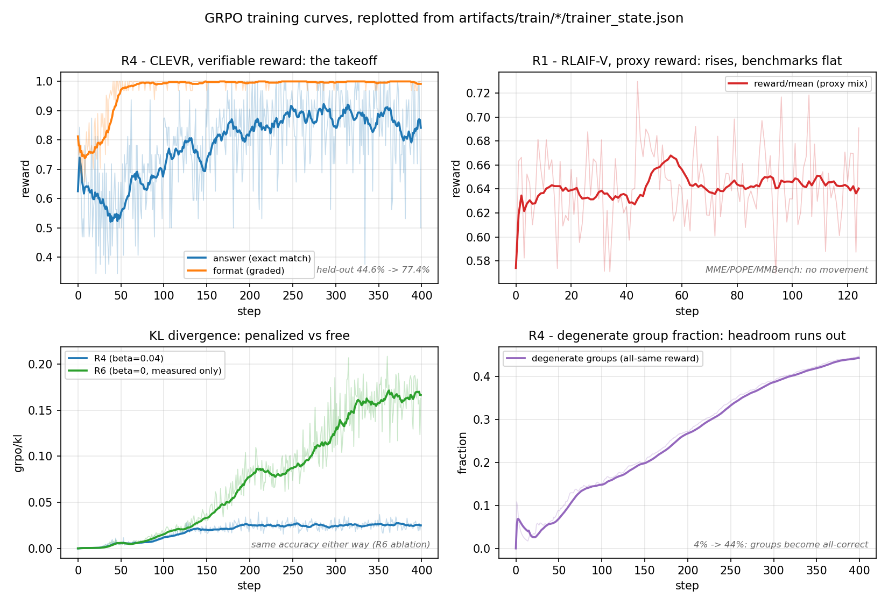

# 多模态 GRPO：机制深读、训练细节与面试问答

> 本文是对 VITA-RL 项目中"多模态 GRPO"路线的代码级深读与知识点总结，
> 覆盖 GRPO 与 PPO/DPO 的取舍、单步训练的完整数据流、每个超参的理由、
> 数学细节（advantage 归一化 / KL 估计器 / 重要性采样 / 长度偏置）、
> 多模态扩展的六个要点、Reward 设计与 Reward Hacking，以及面试问答清单。
>
> 姊妹篇：[`SFT_DPO_DEEP_DIVE.md`](./SFT_DPO_DEEP_DIVE.md)（SFT+DPO 路线深读）。
> 实验过程与数字见 [`EXPERIMENT_LOG.md`](./EXPERIMENT_LOG.md)，
> 架构见 [`ARCHITECTURE.md`](../00-background/ARCHITECTURE.md) §14。

---

## 目录

| 章节 | 内容 |
|---|---|
| [§1 为什么是 GRPO](#1-为什么是-grpo不是-ppo-也不是继续-dpo) | PPO 显存/critic 账、53.6% 可分性探针、GRPO 的结构性优势 |
| [§2 一步训练的完整数据流](#2-一步训练的完整数据流) | fuse → expand → rollout → score → advantage → logps → loss |
| [§3 超参数逐项解释](#3-超参数逐项解释) | R4 实际值逐项核实、三轮对照（batch 对冲噪声）、bf16/tf32/fp32 精度栈 |
| [§4 数学与数值细节](#4-数学与数值细节) | 序列 logp、组归一化与退化组、k1/k2/k3、重要性采样、token 级平均 |
| [§5 首步三不变量](#5-首步三不变量) | kl=0 / ratio=1 / advantage_std=1 及各自的失效含义 |
| [§6 多模态扩展的六个要点](#6-多模态扩展的六个要点) | 融合先于展开、left-padding、generate 绕过、byte-identity 等 |
| [§7 冻结拓扑](#7-冻结拓扑训练哪些参数) | LoRA 范围、mm_projector 双保险、与全参 SFT 的对照 |
| [§8 Reward 设计与 Reward Hacking](#8-reward-设计与-reward-hacking) | 契约、铁律、四规则分工、judge 免解析、hack 面与对冲 |
| [§9 显存速查](#9-显存速查) | 全参 16 字节/参数账、ZeRO 三档、LoRA 对照 |
| [§10 本次真实训练记录](#10-本次真实训练记录2026-08-20) | 训练与对照全记录：R1/R2 代理奖励、R4 可验证奖励 +32.8pt、通用回归/OOD/配平 SFT 对照、R5 阶段二天花板、R6 β=0 消融 |
| [§11 面试问答清单](#11-面试问答清单) | 按出现概率排序，附答案要点 |
| [§12 GRPO 之后的演进](#12-grpo-之后的演进vllm-rollout--dapo--gspo) | vLLM rollout 加速、DAPO 四项修改、GSPO 序列级比值，及与本仓库实现的映射 |
| [§13 训练与推理框架选型](#13-训练与推理框架选型本项目用了什么没用什么为什么) | DDP/ZeRO/FSDP/Megatron 版图、本项目实际栈、HF generate 的精确账、vLLM/SGLang/TRT-LLM 对比、RL 训推一体三问题 |

---

## 1. 为什么是 GRPO（不是 PPO，也不是继续 DPO）

### 1.1 PPO 的账

标准 RLHF-PPO 需要四个模块：policy、reference、reward model、**critic（价值网络）**。
对 7B 多模态模型（一份完整拷贝 ≈ 15GB bf16，含 InternViT）：

| 组件 | 全参 PPO | LoRA 共享技巧下 |
|---|---|---|
| Policy（训练） | 15GB 权重 + 84GB AdamW 状态 | 基座 + adapter |
| Critic（训练） | 又一个 7B：15 + 84GB | 第二个 adapter + value head |
| Reference（冻结） | 15GB | 共享基座（关 adapter） |
| Reward Model（冻结） | 15GB | 规则奖励可省 |

全参 PPO 光两套优化器状态就是 168GB，4×80GB 不可行，8×80GB 上 ZeRO-3 勉强且痛苦。
LoRA 共享技巧能把显存压下来，所以诚实的结论是：**显存不是唯一死因，而是三重代价叠加**——
① critic 要训练（多一套前反向、对稀疏终端奖励的价值估计不稳定）；
② 四模块接线的工程复杂度；③ 每步时间翻倍。
GRPO 用"多采 G 个 rollout"这一份纯推理成本，把 critic 的显存、不稳定性、复杂度一次性全部换掉。

### 1.2 DPO 在这份数据上的死因：可分性 53.6%

`tools/probe_preference_separability.py` 用**冻结的基座**给每对 chosen/rejected 算序列
log-prob，统计"chosen 得分更高"的比例：

```
3000 对（n=400）:  55.2%  CI [50.4%, 60.1%]  p=0.036  SNR 0.11
15000 对（n=500）: 52.2%  CI [47.8%, 56.6%]  p=0.325  SNR 0.055
合并（n=900）:     53.6%  CI [50.3%, 56.8%]  p=0.033
```

log-prob 差均值 +3.89、标准差 35.87——信噪比 0.11，每个 batch 的梯度方向几乎被噪声主导。
第二层根因（查 `origin_split` 元数据）：chosen/rejected 都由 OmniLMM-12B 生成、也由它判定，
对 VITA 是分布外任务。

### 1.3 GRPO 的结构性绕开

GRPO 的信号不来自"两个回答谁好"的偏好标注：**VITA 自己写 G 个回答**（天然 on-policy、
永远在分布内），用**可直接计算的规则**（与 gold answer 的关键词重叠）打分、组内排序。
"别人代写、别人代判"的问题在结构上不可能发生。

核心公式（组内基准替代价值网络）：

```
A_i = (r_i - mean(r_1..r_G)) / std(r_1..r_G)
```

---

## 2. 一步训练的完整数据流

按 `vita/train/grpo_trainer.py` 的 `compute_loss` 顺序：

```
prompt-only records（含 reward_meta）
  → GRPOPromptDataset      tokenize 到 "<|im_start|>assistant\n" 为止
  → GRPOPromptCollator     LEFT-pad（生成从右侧接续）
  → compute_loss:
      1. _fuse             多模态融合：IMAGE_TOKEN_INDEX(-200) 占位符 → InternViT 切片特征
                           视觉塔每张不同图只跑一次；输出 left-padded inputs_embeds
      2. G 折叠展开         (B,P,D) → (B*G,P,D) 纯张量 repeat（融合必须在这之前）
      3. _rollout          Qwen2ForCausalLM.generate(inputs_embeds=...)
                           do_sample, T=1.0, top_p=0.95；采样前 eval() 关 LoRA dropout
      4. _score            RewardCombiner 对每个补全算加权规则奖励 ∈ [0,1]
      5. group_advantages  组内 (r-mean)/std；退化组置零并计数
      6. _sequence_logps   [融合 prompt embeds | 采样 token embeds] 拼接，
                           一次带梯度前向，fp32 log_softmax 后 gather
      7. old_logps = policy_logps.detach()   （单步：ratio 恒为 1）
      8. ref_logps         with disable_adapter(): 再跑一次 _sequence_logps（no_grad）
      9. grpo_loss         -min(ρA, clip(ρ)A) + β·k3KL，completion mask 内 token 级平均
```

---

## 3. 超参数逐项解释

以 **R4（CLEVR，最终成功那轮）实际运行值**为主线（已对照
`outputs/r4_train.log` 的 deepspeed 启动命令逐项核实），R1/R2 的差异
在 §3.2 对照表里。

### 3.1 逐项解释（R4 实际值）

| 参数 | R4 值 | 理由 |
|---|---|---|
| `grpo_group_size` (G) | 8 | 组是 baseline，太小 advantage 噪声大；显存/时间随 G 线性涨。DeepSeekMath 起的惯例值 |
| `grpo_beta` (β) | 0.04 | KL 罚权重（k3 估计器）。R4 里 KL 涨 6 倍但准确率同步涨，说明 leash 没卡住学习。DAPO 的立场（可验证奖励下干脆设 0，§12.2）已被 R6 消融证实：β=0 与 0.04 精度无差（§10 R6） |
| `grpo_clip_eps` | 0.2 | PPO 信任域；**μ=1 时 ratio≡1，clip 惰性**（为 sample reuse 预留，μ>1 才生效） |
| `grpo_num_iterations` (μ) | 1 | 严格 on-policy：每批 rollout 只更新一次 |
| `grpo_temperature` / `top_p` | 1.0 / 0.95 | 温度 1.0 = 不改分布地随机采，组内多样性全靠采样本身；top_p 砍长尾乱码。温度太低组内趋同 → 全退化组 → 无训练信号 |
| `grpo_max_new_tokens` | 128 | 计数的 `<think>` 推理 + 答案够用；直接决定 rollout 时间上限（R1/R2 开放式描述用 256） |
| `reward_fns` | `answer:1.0,format:0.3` | 二值精确匹配为主信号；格式奖励权重压到 0.3，防止只学格式不学计数 |
| `learning_rate` | 5e-6 + cosine + 3% warmup | R1 用 1e-6 几乎不动，R2 起提到 5e-6（这是 LoRA 参数的 lr）。见下"lr 详解" |
| LoRA | r=64, α=16, **dropout=0** | dropout 必须为 0：rollout 采样和 log-prob 计算必须是同一个策略；参考 pass 关 adapter 天然无 dropout，policy 侧有 dropout 会让首步 KL 无端非零 |
| 卡数 / micro-batch / 累计 | 4 卡（GPU 2,3,4,6）× 1 × 4 | **有效 batch = 16 prompts/优化步 = 128 rollouts/步**。400 步共 6,400 个互不重复 prompt（数据集的 9.3%，Trainer 日志 `epoch: 0.09` 交叉验证）× G=8 = 51,200 条 rollout，实跑 3h15m（29.3s/步） |
| ZeRO | **2 而非 3** | LoRA 下 ~28GB/卡够用；`disable_adapter()` 在 ZeRO-3 参数分片下行为复杂 |
| 精度 | bf16 + tf32 | 见 §3.3 |
| `dataloader_num_workers` | 0（多卡多模态） | /dev/shm 仅 512MB，多 rank × N worker 传 448×448 切片会 Bus error |

**lr 详解（cosine + 3% warmup）**：
warmup（前 12/400 步线性升到峰值）——Adam 动量估计初期不可靠 + LoRA B
矩阵零初始化，先热身再全速；
cosine 衰减到 0——RL 尾段大步长比 SFT 更危险（策略移动改变采样分布，
末期抖动会把学到的东西采样崩掉）；
峰值 5e-6——策略每动一步 rollout 分布就变，大步长 → KL 爆涨或 reward
hacking；R1 的教训是 1e-6 太保守，信号干净时 5e-6 稳定可用。

### 3.2 三轮对照：batch 大小是用来对冲信号噪声的

| | R1 (RLAIF-V) | R2 (RLAIF-V+judge) | R4 (CLEVR) |
|---|---|---|---|
| lr | 1e-6 | 5e-6 | 5e-6 |
| β | 0.04 | 0.01 | 0.04 |
| 有效 batch | 64 prompts/步 | 64 | **16** |
| max_new_tokens | 256 | 256 | **128** |
| reward | keyword/length/no_repeat | + judge(gold) | **answer + format** |
| 结果 | 训练 reward 涨、benchmark 不动 | KL 涨 6 倍、内容 reward 不动 | **44.6%→77.4%** |

值得记住的反直觉点：**R4 的有效 batch 只有 R1/R2 的 1/4，反而成功了**。
因为可验证奖励的信噪比高，不需要靠大 batch 平均掉代理奖励的噪声。这和
DPO 线"SNR 低所以 batch 必须 16→63"是同一原理的两面：batch 是用来
对冲信号噪声的，信号干净时小 batch 就够。同理，R4 只用了数据集 9% 的
prompt、每个 prompt 只拿 8 比特对错反馈就 +32.8pt——数据效率来自
信号质量，不是数据量。

### 3.3 精度栈：bf16 / tf32 / fp32 各管什么

| 格式 | 位分配（符号/指数/尾数） | 动态范围 | 在本训练中的角色 |
|---|---|---|---|
| fp32 | 1/8/23 | ~10³⁸ | 优化器主权重与动量（ZeRO-2 切分）、log_softmax |
| **tf32** | 1/**8**/**10**（共 19 位） | 与 fp32 相同 | 残余 fp32 矩阵乘在 Tensor Core 上的执行格式 |
| bf16 | 1/8/7 | 与 fp32 相同 | 前向/反向的主体存储与计算精度 |
| fp16 | 1/5/10 | 仅 ~10⁴ | 未用于训练（易溢出）；推理侧视觉/音频编码器用 |

- **TF32** 是 Ampere+ 的矩阵乘内部格式：指数位抄 fp32（不溢出）、尾数位
  抄 fp16（够快），乘法用 19 位、**累加仍 fp32**。`--tf32 True` 即
  `torch.backends.cuda.matmul.allow_tf32=True`，让仍以 fp32 请求的
  矩阵乘走 Tensor Core（快 ~8 倍）。bf16 训练里大头矩阵乘本来就是
  bf16，TF32 只是"补角落"的加速，无理由不开。
- **刻意反向的一处**：`_sequence_logps` 把 logits 显式 `.float()` 后再
  log_softmax——log-prob 之差（ratio、KL）对精度极敏感，bf16 的 7 位
  尾数会让首步不变量 `kl=0`、`ratio=1` 出现可见漂移。log_softmax 不是
  矩阵乘，TF32 管不到它，这是老实的 fp32 逐元素运算。
- 三层分工一句话：**bf16 管主体精度，tf32 管残余 fp32 矩阵乘的速度，
  ZeRO-2 管优化器状态/梯度怎么切分到多卡**——互相独立，各管一层。

---

## 4. 数学与数值细节

### 4.1 序列 log-prob 怎么算

自回归分解 + 一次前向拿全部 token 的 logp：

```python
logits = model(input_ids).logits         # (B, L, vocab)
logits = logits[:, :-1, :]               # 位置 t 预测 token t+1 → 错一位
labels = input_ids[:, 1:]
logps  = log_softmax(logits.float(), -1) # 必须先升 fp32
token_logp = logps.gather(-1, labels.unsqueeze(-1)).squeeze(-1)
seq_logp   = (token_logp * mask).sum(-1) # mask 只盖回答部分
```

- **shift**：causal LM 位置 t 的 logits 是对 t+1 的预测。GRPO 里 `pred = logits[:, P-1 : P-1+T]`。
- **mask**：prompt / 图像 token / padding 不计入。
- **求和而非平均**：概率的定义。探针能直接比 chosen/rejected 是因为两者平均长度几乎相同（299 vs 298 字符）。
- **fp32**：bf16 直接 log_softmax 误差大三个数量级（0.0061 vs 6.29 nats，CPU 测试套件实测）。

### 4.2 组内归一化与退化组

`group_advantages`（`grpo_loss.py`）：

- std 用 **population 版**（`unbiased=False`）：G=1 时无偏版是 NaN，会绕过下面的保护。
- **退化组**：全组同分 → std=0 → 0/0=NaN 静默污染梯度。规则奖励下训练早期是常态而非边角。
  处理：advantage 置零 + 计数，监控 `groups/degenerate_frac`——**它高说明奖励区分不了样本，
  是奖励/数据问题伪装成训练问题**。
- 诚实的偏差讨论：组均值**包含 r_i 自己** → O(1/G) 偏差（RLOO 用 leave-one-out 修正）；
  除以组内 std 也引入偏差（不同难度 prompt 被不同尺度缩放，Dr. GRPO 主张去掉）。
  G=8 时实践影响小，但知道它们存在是"真理解"的标志。

### 4.3 KL 的 k1/k2/k3 估计器

从 x~π 采样估计 KL(π‖π_ref)，r = π_ref(x)/π(x)（Schulman, *Approximating KL Divergence*）：

| 估计器 | 公式 | 无偏 | 非负 | 方差 | 问题 |
|---|---|---|---|---|---|
| k1 | −log r | ✅ | ❌ | 高 | 单样本可为负，日志乱跳 |
| k2 | (log r)²/2 | ❌ | ✅ | 低 | 二阶近似，分布拉开后低估 |
| k3 | (r−1)−log r | ✅ | ✅ | 低（r≈1） | r≫1 时数值爆（被 KL 罚本身抑制） |

k3 无偏因为 E[r]=1；非负由凸性 r−1≥log r。本项目用 k3 且**直接作为可微罚项**
（`kl = exp(d)−d−1`，d=ref−policy），它在 r=1 处梯度为 0——参考点附近不受无谓推力。
判读：k3 恒非负 → `grpo/kl` 上升一定是真实漂移，不是采样噪声。

### 4.4 重要性采样比（`grpo/ratio`）

ρ_t = π_θ(y_t)/π_old(y_t) = exp(policy_logp − old_logp)。

- **动机**：rollout 是最贵的一步，PPO 想对同一批 rollout 做多次更新（sample reuse）。
  第二次起 θ 变了、数据是旧策略采的，重要性采样是修正这个分布错配的数学工具：
  E_p[f] = E_q[(p/q)·f]。
- **限制**：ratio 方差随分布差距指数涨 → clip 是它的方差保险丝；PPO 实践只复用 2–4 个 epoch。
  它修正一阶期望，不是真 off-policy（和 Q-learning 不同）。
- **默认单步**：old = 当前策略的 detach → **ratio 值恒为 1，但梯度不为 0**：
  ∇(ρA) |_{ρ=1} = A·∇log π_θ，正是 REINFORCE（带 baseline）。
  所以默认数学上等价于"单步策略梯度 + KL leash"，clip 惰性（`clip_frac` 恒 0）。
- **sample reuse 已实现**（`--grpo_num_iterations`，即 DeepSeekMath 的 μ）：
  每批 rollout 用于 μ 个**连续优化步**。采样器按"每优化步全局 prompt 数"分块、
  每块连续重复 μ 次（重复必须跨优化步——同一累积窗口内 θ 未动，重复只是复制梯度）；
  iteration 0 付全价并缓存（补全/奖励/old & ref logp/融合 embeds——视觉塔和
  embed_tokens 都冻结，embeds 是常量），iteration 1..μ-1 只重算 policy logp
  （约 35% 成本），此时 ratio≠1、clip 真正生效。μ=4 时同样更新数省约 2 倍时间。
  代价：后 μ-1 次更新轻度 off-policy，`clip_frac` 一高等效样本量缩水（PPO 实践 μ=2-4）。
  烟雾实测（lr 1e-4 放大观察）：复用步 ratio 0.996-0.999、clip_frac 0.002-0.028，
  新 rollout 步 ratio 精确回 1，缓存对齐断言零触发。

### 4.5 token 级平均与长度偏置

```
序列级平均:   L = mean_i ( mean_t loss[i,t] )    每条序列权重相等
token 级平均: L = sum_{i,t} loss[i,t] / 总token数  每个 token 权重相等（本项目）
```

token 级下 96-token 补全的梯度贡献是 24-token 的 4 倍（长回答主导 batch）；
序列级则稀释长回答内部每个 token 的信号（DAPO 指出并改用 token 级）。
Dr. GRPO 更进一步：长度归一化和 std 归一化都引入 bias，主张全部去掉。
本项目用 token 级 + `length` reward 对冲长度激励。

---

## 5. 首步三不变量

第一步更新前 policy ≡ reference（LoRA B 矩阵零初始化，adapter 输出恒 0），
所以三个量有精确已知值——不花训练时间的接线正确性测试：

| 信号 | 期望 | 失效指向 |
|---|---|---|
| `grpo/kl` | = 0 | 参考 pass 忘关 adapter；**mm_projector 逃出冻结**（disable_adapter 关不掉它，KL 还显示"正常"）；LoRA dropout 非 0；文本路径过了 preprocess_multimodal 的换行归一化 |
| `grpo/ratio` | = 1 | old_logps 来自另一次前向（bf16 漂移 ~4e-3）；mask 错位；采样与打分间模型状态不一致（如 dropout 没关） |
| `grpo/advantage_std` | ≈ 1（活跃组） | 组归一化没生效或退化组处理有 bug |

---

## 6. 多模态扩展的六个要点

1. **融合先于 G 折叠**（核心设计）：B 个 prompt 先融合（视觉塔跑 B 次），embedding 层面
   repeat 到 B*G。G=8 省 87.5% 视觉前向。**不是全局预缓存**——是单步内部的执行顺序。
   对照 DPO：chosen/rejected 共享一张图，用 `image_group_size` 显式去重（省 46%）；
   GRPO 每个 prompt 自带图，天然无需去重参数。
2. **left-padding**：generate 只会从 batch 张量最右端追加。right-padding 下短 prompt 和
   生成内容之间隔着 PAD，续写全乱。left-padding 把所有 prompt 结尾对齐到右边界；
   PAD 在左侧由 attention mask 屏蔽、position id 从 mask 推导。
   易错点：train.py 把 `tokenizer_padding_side` 设为 "right"（SFT 正确），
   `_fuse` 必须幂等地覆盖成 "left"。
3. **generate 绕过**：`VITAQwen2ForCausalLM.generate` 对 `inputs_embeds` 抛
   NotImplementedError，直接调父类 `Qwen2ForCausalLM.generate`——这也是
   "视觉塔每 prompt 只跑一次"成立的依赖。
4. **重算 logp 而非取 generation scores**，三个原因：
   ① generate 在 no_grad + KV cache 下跑，没有计算图，**不可能反传**——带梯度前向反正要做；
   ② old_logps 取自同一次前向的 detach → ratio **精确** 为 1（两次前向有 bf16 噪声）；
   ③ generate 的 scores 是过了 logits processor（top_p 截断重归一化）之后的分布，
   不是策略的原始 logp，拿它当 π_old 在数学上就是错的。
   （实测重算与 generation scores 吻合到 ~4e-3。）
5. **文本路径 byte-identity**：文本记录绝不能过 `preprocess_multimodal`
   （`\n\n→\n` 归一化改变分词，破坏 kl==0 不变量）。
6. **EOS 之后是垃圾**：completion mask 只盖到第一个 EOS；之后采样器补的 padding
   不参与 reward 解码和 loss。

---

## 7. 冻结拓扑：训练哪些参数

**只训 LLM 上的 LoRA adapter（27.5M），其余全部冻结**，两道机制：

1. `find_all_linear_names`（train.py:157）给所有 `nn.Linear` 挂 adapter，
   **显式排除** `vision_tower` / `mm_projector` / `vision_resampler` / `audio_encoder` / `lm_head`。
2. train.py 的 `initialize_vision_modules` 会强制重开 mm_projector 的梯度
   （上游"In case it is frozen by LoRA"），train_grpo.py / train_dpo.py 在建 trainer 前
   把**名字不含 `lora_` 却 requires_grad 的参数全部冻回去**并打印总量。

为什么必须严格：**参考策略 = 关 adapter 的同一个模型**，成立的充要条件是所有可训练参数
都在 adapter 内。若 projector 可训练，它漂移后 disable_adapter 关不掉，"参考"跟着策略走，
KL 拴着一个移动的桩子，日志看不出异常。
对照：第 5 轮 SFT 是全参的（训 LLM+projector，冻视觉塔）——SFT 不需要参考模型，无此约束。

---

## 8. Reward 设计与 Reward Hacking

### 8.1 契约与结构

- 每个奖励是 `(prompt, response, meta) → [0,1]` 纯函数。**有界**是 `--reward_fns
  keyword:1.0,length:0.4` 权重可解释的前提（能返回 100 的奖励会静默压过其他项）。
- `reward_meta` 随样本走（关键词表 / 目标长度窗 / 期望 state token），规则读 meta
  而不硬编码标准——同一规则通吃烟雾数据和 RLAIF-V。
- 注册表模式（`@register_reward`）+ `RewardCombiner` 加权求和归一：换 RM、加规则不碰 trainer。

### 8.2 两条铁律

1. **必须能区分**：advantage 是组内 (r−mean)/std，全组同分的规则贡献恰好为零。
   连续打分优于 pass/fail（keyword 用命中比例、length 用线性衰减）。
2. **必须便宜**：每步 512 个 rollout 都要打分，规则在训练热路径上。

### 8.3 四规则分工（真实训练权重）

| 规则 | 权重 | 作用 | 对冲的 hack |
|---|---|---|---|
| `keyword` | 1.0 | gold answer 内容词命中率（groundedness 主信号） | — |
| `length` | 0.4 | gold 长度 0.6x–1.8x 窗口，窗外线性衰减 | 凑长度 / 一词答案 |
| `no_repeat` | 0.3 | distinct 3-gram 比例 | 复读循环 |
| `state_token` | 0.3 | VITA 的 ☜☞☟ 回复格式 | RL 破坏格式约定 |

**judge reward 的免解析设计**：读 judge 模型在第一个生成位置对 token "1"–"5" 的
概率分布取期望、rescale 到 [0,1]。连续（组内可排序）、零解析失败、一次前向、lazy 加载。

数据侧配合（`make_rlaif_v_grpo_data.py`）：停用词过滤 + ≥3 字母 + 保序去重 +
**cap 8 个关键词**（防长答案主导）；gold <4 字符丢弃（"Yes" 挖不出关键词 → 必然退化组）；
>600 字符丢弃。本次 8000 条 prompt 平均 7.8 关键词、退化组率 ~7%。

### 8.4 Reward Hacking

**定义**：策略优化的是 reward 函数本身而非其代理的意图（Goodhart's Law）。

本项目的具体 hack 面与防线：
- `keyword` → **堆砌关键词**而非真实描述（`no_repeat`+`length` 对冲，但"多写相关词"仍是
  proxy reward 的固有漏洞）；
- `length` → 凑长度（权重只有 0.4，窗口来自 gold 长度）；
- 结构性防线：**单步 on-policy + KL leash（β=0.04）+ lr 1e-6**——策略每步只能小幅移动
  且被拴在基座附近；
- 良性示例：文本烟雾里 length reward 存在时补全长度 96→30 token——策略在**一字不差地**
  优化你给它的东西。

**监控**：`completion/len` 突变、`reward/mean` 与人工抽查质量脱钩、`degenerate_frac` 趋近 1。
**最终裁判必须是 held-out 基准**（POPE/MMBench），绝不能是 reward 本身。
经典案例：CoastRunners 赛艇转圈、RLHF 长度偏置、sycophancy。
缓解清单：奖励有界化、多正交奖励组合、KL 正则、RM ensemble、人工审查 rollout、独立基准评估。

---

## 9. 显存速查

**全参训练 16 字节/参数**（bf16 权重 2 + bf16 梯度 2 + fp32 master 4 + AdamW m/v 各 4）：
7.6B → ~122GB。单卡实测死在第一次 `optimizer.step()` 前分配 `exp_avg_sq`
（前反向能跑完 ≠ 能训练——AdamW 状态是懒分配的）。

| ZeRO 档 | 切分内容 | 每卡静态（7.6B，8 卡） |
|---|---|---|
| 1 | 优化器状态 | ≈ 41.8 GB |
| 2 | + 梯度 | ≈ 28.5 GB |
| 3 | + 参数 | ≈ 15.2 GB（实测 ~18GB，差值 = 激活 + logits 尖峰 + ZeRO 缓冲） |

**logits 尖峰**：词表 ~152k，6200 token 的 logits bf16 ≈ 1.9GB，CE 里 fp32 上采样再翻倍。

**LoRA 对照**：可训练 161.5M（2.12%），优化器状态 ~2.6GB，单卡峰值 23.3GB
（一张 24GB 卡就能训）。DPO/GRPO 用 ZeRO-2 即可；GRPO 额外成本是 G=8 rollout 的
生成 KV cache 与三份 logp 前向（其中参考前向 no_grad + 关 adapter，零额外权重）。
详细推导见 [`SFT_DPO_DEEP_DIVE.md`](./SFT_DPO_DEEP_DIVE.md) §4。

---

## 10. 本次真实训练记录（2026-08-20）



> 四个面板 = 本节四个核心结论：R4 可验证奖励起飞（format 先饱和、answer 后爬坡）；
> R1 代理奖励涨了但基准纹丝不动；R6 去掉 KL 惩罚后 KL 自由涨到 R4 的 6 倍**而精度不变**；
> R4 退化组比例 4%→44%（headroom 耗尽 = 学成）。
> 图由 `tools/plot_training_curves.py` 从 [`artifacts/train/`](../../artifacts/README.md)
> 的 trainer_state 直接重画，不依赖 wandb。

| 项 | 值 |
|---|---|
| 机器 | 8×H100 80GB（KML 开发机），用空闲的 GPU 2/3/4/6 |
| 环境 | `/data/agent/conda/envs/vita-rl`（torch 2.3.1+cu121 / transformers 4.41.1 / flash-attn 2.5.9.post1） |
| 数据 | RLAIF-V 分片 000/001/003/004 → `make_rlaif_v_grpo_data.py --limit 8000`：8000 prompts / 5205 去重图 / 平均 7.8 关键词 |
| 配置 | GPUS=2,3,4,6，GRAD_ACC=16 → 有效 batch 64 prompts/step，G=8，共 125 步，约 4.5–5h |
| 指标 | wandb 项目 `vita-rl-grpo`，run `grpo-rlaif-v-8k-4gpu`（ucwf96ug） |
| 首步验证 | `grpo/kl=0.0`、`ratio=1.0`、`advantage_std≈1`、退化组 ~7% ✅ |

前置烟雾（同环境）：
- 文本 GRPO（12 步 43s）：reward/mean 0.75→0.93，补全长度 96→30 token（length reward 生效），kl₁=0 ✅
- 图像 GRPO（8 步 52s）：kl₁=0（融合参考策略接线正确），reward/keyword 0.375–1.0 非零
  （视觉特征真实到达策略）✅ —— 多模态 GRPO 扩展的首次运行时验证

训练收尾（125/125 步，4h51m）：reward/mean 0.55→0.72（趋势上升），
`grpo/kl` 收在 0.0006，退化组 1.9%，ratio 恒 1、clip_frac 恒 0（单步 on-policy 预期）。

**评测结果**（`tools/merge_and_eval.py` 合并 adapter → VLMEvalKit，
baseline 与 GRPO 各 2 卡并行，规则判分）：

| 基准 | baseline | GRPO | Δ | 判读 |
|---|---|---|---|---|
| MME total | 2353.51 | 2354.53 | +1.02 | 噪声内 |
| POPE Overall | 89.14 | 89.12 | −0.02 | 噪声内 |
| MMBench_DEV_EN_V11 | 77.79% | 77.79% | ±0.00（1.96σ = ±2.27） | 逐项全同 |

**诚实的结论**：训练奖励在涨、但下游基准纹丝不动——与 KL 只有 0.0006 完全自洽：
lr 1e-6 + β=0.04 的 KL leash 下，125 步内策略只做了极小幅度的移动
（POPE/MME 上有个位数样本的答案变化，证明合并生效、管线无误；MMBench 单字母
选择题对微小权重差完全不敏感）。这**不是管线失败，而是剂量不足**：
本轮的目的是端到端跑通并验证 GRPO 全链路（它做到了），要移动基准需要
更多步数（多 epoch）、更高 lr、或更强的奖励信号（judge reward 换掉规则奖励）。
与 DPO 的教训呼应：可靠的管线 + 弱信号 = 安全但缓慢。

评测运维备注：两个评测进程并发首次解码同一份 MMBench 图片目录会踩
写一半的 jpg（`UnidentifiedImageError`），断点续跑即可（预测缓存在
work-dir 的 pkl 里）；无 OpenAI key 时 vlmeval 对 MMBench 回退精确匹配判分，
两侧口径一致，对比仍有效。

### Round 4：换可验证奖励（CLEVR counting），曲线起飞

r2（RLAIF-V + judge，lr 5e-6 / β 0.01）跑了 91 步：KL 涨 6 倍但
keyword/judge 无趋势——策略在动、reward 没跟上，证实问题不在剂量而在
**信号结构**：开放式描述 + 代理奖励下，组内排序 ≈ 风格噪声排序。
诊断后弃用代理奖励，转 R1-V 配方（可验证奖励）：

| 项 | 值 |
|---|---|
| 数据 | `leonardPKU/clevr_cogen_a_train`（CLEVR-70k 数数）→ `make_clevr_grpo_data.py`：69,500 训练 + 500 held-out，答案均匀分布 3–10 |
| Reward | `answer:1.0`（二值精确匹配）+ `format:0.3`（`<think></think><answer></answer>`），代理奖励全部退役 |
| 配置 | GPUS=2,3,4,6，GRAD_ACC=4 → 16 prompts/step，G=8，lr 5e-6，β 0.04，μ=1，400 步（3h15m，29–35s/步） |
| 守门 | 开训前先测基座 held-out 准确率 = 44.6%，落在可训练区间（10–90%）才放行 |
| wandb | run `grpo-clevr-r4`（tvyusoul） |

训练动力学（1600 条日志分 10 窗）：format 0.81→0.99 先饱和（几十步内），
answer 0.59→0.89 随后爬坡，KL 缓升收在 0.025，退化组 4%→44%
（后期大量"8 发全中"组 = headroom 被学掉，非故障）。
两段式曲线 + 全部首步不变量成立。

**评测结果**（500 条 held-out，greedy，`eval_grpo_heldout.py`）：

| 指标 | baseline | GRPO-400 步 | Δ |
|---|---|---|---|
| answer_accuracy | 44.6% | **77.4%** | **+32.8pt** |
| win_rate | — | 0.977 [95% CI 0.953–0.994] | 远超噪声 |

对标 R1-V（Qwen2-VL-2B，100 步 48%→82.5%，SuperCLEVR OOD）：量级一致。

**方法论结论（面试叙事）**：同一套 GRPO 实现，在代理奖励数据上 125+91 步
纹丝不动，换可验证奖励后 400 步 +33pt——GRPO 的成败首先取决于
**reward 是否能把组内 rollout 按真实能力排序**，其次才是超参剂量。
诊断链条：KL 动/reward 不动 → 信号结构问题 → 换任务而非调参。

### R4 后续验证（2026-08-21）：通用回归 + OOD + SFT 对照

补上 R4 结果缺的三块证据（当时的不足清单里排前两位的项）：

**1）通用能力回归**（R4 合并模型重跑 VLMEvalKit 三基准，对照基座）：

| 基准 | baseline | GRPO-R4 | Δ | 判读 |
|---|---|---|---|---|
| MME total | 2353.51 | 2354.26 | +0.75 | 噪声内 |
| POPE Overall | 89.14 | 89.07 | −0.07 | 噪声内（precision −0.14 / recall ±0） |
| MMBench_DEV_EN_V11 | 77.79% | 77.63% | −0.15（1.96σ = ±2.27） | 27 个子项里 25 个逐分全同 |

+32.8pt 的专项提升**没有以通用能力为代价**——LoRA（0.6% 参数）+
β=0.04 的 KL leash 把策略移动限制在计数任务附近，MMBench 子项几乎
逐字节不动是最直观的证据。顺带一个反直觉观察：MME 的 count 子项也
纹丝不动（175→175）——它是"是否有两个 X"式的 yes/no 题，与
`<answer>N</answer>` 的产出格式不同构，专项能力不会自动迁移到
异构格式的同名任务上。

**2）OOD 泛化（SuperCLEVR test200，R1-V 同款）+ 3）SFT 对照**：

SFT 对照严格配平数据预算：同一 69.5k 训练池采样**同量 6,400 个
prompt**（排除 held-out 尾部），gold solution 直接做监督目标
（`tools/make_clevr_sft_data.py` + `script/train/sft_clevr.sh`），
LoRA 容量（r64 α16）、有效 batch（16）、步数（400）与 GRPO 全同；
lr 用 LoRA-SFT 的标准值 1e-4（拿 RL 的 1e-6 喂 SFT 等于人为削弱对照）。
26 分钟跑完（GRPO 同步数 3h15m，7.5 倍成本差），loss 1.01→0.016。

| 评测 | base | GRPO-R4 | SFT 对照 |
|---|---|---|---|
| CLEVR held-out 500（分布内） | 44.6% | **77.4%** | 75.4% |
| SuperCLEVR 200（OOD） | 37.5% | 54.5% | **63.0%** |

win rate（对 base）：GRPO OOD 0.793 [0.690, 0.897]，SFT OOD
0.840 [0.747, 0.920]——两者都远超噪声，但**SFT 在 OOD 上反超 GRPO
8.5pt**，与 R1-V 报告的"SFT 泛化差、RL 泛化好"方向相反。

**诚实的解读**（这比复述论文结论更有信息量）：
- R1-V 的对照是 **2B 模型 + 全参微调**——SFT 全参更新容易灾难性地
  过拟合到训练分布；这里两个 arm 都被 LoRA 约束在低秩子空间里，
  SFT"崩掉泛化"的机制被容量约束挡住了。
- 本数据集的 solution 是**裸答案**（`<answer> N </answer>`，无思维链），
  SFT 学到的就是"看图输出数字"，没有可过拟合的推理风格。
- 逐样本复盘排除了解析伪影：GRPO 的 200 条 OOD 输出**零截断、全部
  可解析**（曾怀疑 `<think>` 链撞 96 token 上限，实测没有），91 条是
  真数错——GRPO 的思维链（平均 33 词）在 OOD 场景枚举物体时本身
  出错，SFT（平均 3 词）直接报数反而更稳。差距是真实能力差。
- 结论不是"GRPO 不如 SFT"，而是：**当 gold 可以直接模仿时，
  监督模仿是又快又强的 baseline（26min vs 3h15m）**；GRPO 的结构性
  优势要在 gold 只能校验、不能模仿（无参考答案文本，只有 verifier）
  或需要长推理链的任务上才兑现。这也解释了为什么 R1 系工作都强调
  "verifiable reward + 无 SFT 数据可用"的设定。

复现入口：`tools/make_superclevr_eval_data.py`（OOD 集转换）、
`tools/make_clevr_sft_data.py`（配平 SFT 数据）、
`script/train/sft_clevr.sh`（对照训练）。

### R5（2026-08-21）：阶段二对照——同一 SFT 起点，续 SFT vs 接 GRPO

R4 后续验证留下的问题：SFT 分布内追平 GRPO 之后，第二阶段该继续 SFT
还是切 GRPO？对照设计把监督信号形态压成唯一变量：

- 两臂都从**同一个** SFT-6.4k 合并权重出发（字节相同）；
- 阶段二喂**同一批**新采样的 6,400 prompt（`make_clevr_stage2_data.py`
  重建阶段一采样逐条排除，同一份采样写出 SFT/GRPO 双格式）；
- 同步数（400）、同有效 batch（16）、同 LoRA 容量（合并权重上的新 r64）；
- 不配平（方法自带）：lr（SFT 1e-4 / GRPO 5e-6）、FLOPs（GRPO 每
  prompt 8 rollouts，3h15m vs 26min）。

| 模型 | held-out 500 | SuperCLEVR 200（OOD） |
|---|---|---|
| A：SFT-6.4k（起点） | 75.4% | 63.0% |
| B：A + GRPO 400 步 | 76.2%（+0.8 噪声内；500 条只 8 条输出改变） | 62.0%（−1.0 噪声内） |
| C：A + 续 SFT 400 步 | 78.0%（+2.6，win rate 0.842 勉强超噪声） | 60.5%（−2.5，轻微过拟合） |

**三个结论**：

1. **任务天花板 ~77–78%**：裸 GRPO（R4）77.4、SFT→SFT 78.0、SFT→GRPO
   76.2，互在噪声内。剩余错误是"硬核"——SFT 无梯度（阶段二 loss 从第
   一步起就在 0.01–0.03 平底抖动，wandb `sft-clevr-s2-armC`），GRPO 无
   方差（B 臂开局退化组即 75%：p≈0.88 时全对组 \(0.88^8≈36\%\) 起步）。
2. **GRPO 从强起点推不动是机制性的**：退化组吃掉 3/4 算力 + KL 锚定
   SFT 策略，3h15m 只改变 8/500 条输出。handoff 点影响算力效率而非
   终点——终点由任务上限决定（R4 从裸基座也到 77.4）。DAPO 的
   dynamic sampling（§12.2）对症的正是这 75% 的浪费。
3. **对 gold 可模仿的任务，SFT 全面占优**（同终点、1/7.5 成本、OOD
   还最高）。GRPO 在本仓库的价值是科学验证（只靠 verifier 不碰 gold
   文本也能到同一天花板），其工程价值兑现的条件——gold 只能校验不能
   模仿（数学/代码 verifier）、或需塑形 gold 里不存在的行为（长推理
   链）——本任务不具备。这就是"何时 SFT / 何时 GRPO"的实证答案：
   **SFT loss 还在降就 SFT；loss 见底且剩余错误 pass@G > pass@1 才轮
   到 GRPO；pass@G ≈ pass@1 时换更强基座，谁也救不了**。

### R6（2026-08-24）：β=0 消融——KL 项在可验证奖励下是否多余

§3 超参表和 §12.2（DAPO）都提出过同一个疑问：R4 里"KL 涨 6 倍但准确率
同步涨"说明 leash 没卡住学习，那它还有存在的必要吗？R6 用单变量消融
回答：**与 R4 完全同配置**（CLEVR、G=8、lr 5e-6、answer:1.0+format:0.3、
400 步、4 卡、3h03m），唯一变量 `--grpo_beta 0`——不算 KL 罚项，
参考模型前向也随之省掉。

| | R4（β=0.04） | R6（β=0） | 说明 |
|---|---|---|---|
| held-out 500 | 44.6→**77.4%** | 44.6→**77.0%** | 差 0.4pt，噪声带 ±3.7pt 内 |
| win rate | 0.977 [0.953, 0.994] | 0.976 [0.953, 0.994] | 几乎逐位相同 |
| SuperCLEVR OOD 200 | 37.5→54.5% | 37.5→**56.5%** | +2.0pt，噪声带 ±6.9pt 内 |
| 训练中 KL | 被压在 ~0.06 | 自由涨到 ~0.19 | 无 leash 也未失控 |
| 尾段退化组比例 | ~50% | ~54% | 同样的信号枯竭形状 |

**三个结论**：

1. **可验证奖励 + 单步 on-policy 下，KL 项对最终精度没有可测影响**。
   DAPO 去 KL 的立场在本实现上得到消融级验证。机制解释：二值 answer
   奖励没有可刷分的捷径方向（不像代理奖励），策略即使自由漂移，漂移
   方向也被"答对才有优势"锚定；而 μ=1 时每步都从当前策略采样，
   off-policy 漂移无从累积。
2. **省掉的不只是超参**：β=0 时参考模型 logp 前向可以整个跳过（本次
   为保留 KL 诊断曲线仍计算了它，但不参与 loss）。对 rollout 占大头的
   GRPO 这不是主要开销，但在训推分离架构下少一份参考权重是实打实的。
3. **~77–78% 天花板第三次复现**（77.4 / 78.0 / 77.0），加上 OOD 的
   54.5 vs 56.5 互换，进一步确认 R4/R6 的差异全在噪声里——到这个上限
   之后，超参已经不重要了。

**边界**：这个结论的适用条件是"奖励可验证 + 单步复用"。代理奖励
（会被 hack）或 μ>1 大步复用（off-policy 漂移累积）的场景下 KL/clip
仍是必要防线——R2 的教训（KL 涨 6 倍而内容奖励无趋势）就是反例。

---

## 10.5 指标手册（每个 logged 指标的含义与诊断）

按三组理解：reward 组（信号质量）、grpo 组（算法内部状态）、生成行为组。

### Reward 组

- **`reward/answer`**：批内答案精确匹配真值的比例（每条日志 = 1 prompt x 8
  rollout 的组均值，取值只能是 0/8..8/8，单条跳动大，看平滑曲线）。本质是
  训练集上的**采样**准确率（温度 1.0，低于 greedy 评测值，不能直接比）。
  可验证任务的唯一主指标。
- **`reward/format`**：结构分均值（完整 `<think></think><answer></answer>`
  = 1.0，仅 answer 标签 = 0.5，无 = 0）。预期几十步饱和；饱和后梯度贡献
  消失，训练交给 answer 驱动——这是权重 0.3 的设计意图。
- **`reward/mean` / `std` / `max`**：加权组合后的批内统计。`std` 是信号
  强度计（趋 0 = 无梯度）；`max` 应贴 1.0（组里有满分榜样可学），长期
  到不了 1 说明任务太难。

### GRPO 组

- **`grpo/kl`**：对冻结参考模型的 KL，k3 估计器 E[e^Δ - Δ - 1]
  （Δ = ref logp - policy logp），非负低方差。首步必须 = 0（不变量）。
  缓升健康；暴涨 = 跑飞/hacking 警报（r2 的教训：KL 涨 6 倍而 reward 不动
  = 付出了偏离没换来能力）。
- **`grpo/ratio`**：重要性比 exp(logp_new - logp_old) 均值。mu=1 恒 1
  （纯校验位，偏离 = 实现 bug，如 dropout 未关）；mu>1 的复用步才偏离 1，
  度量 off-policy 程度。
- **`grpo/clip_frac`**：ratio 出 [1-eps, 1+eps] 被裁的 token 占比。mu=1 恒
  0；复用步 >0.2 说明策略步子太大、mu 该调小。
- **`grpo/policy_loss`**：策略梯度项。**没有"应该下降"的语义**——advantage
  组内归一化后均值为 0，loss 期望在 0 附近震荡。收敛看 reward 曲线，
  不看 loss（RL 与监督学习直觉的最大差异之一，面试常考）。
- **`grpo/advantage_mean` / `advantage_std`**：构造上必然 ~0 / ~1（浮点
  误差 1e-8 级）。实现正确性哨兵，偏离 = 归一化或分组对齐 bug。

### 生成行为组

- **`completion/len`**：首个 EOS 前的有效 token 数均值。两个方向都要警惕：
  暴涨 = 凑长度/复读（KL 太松的症状）；骤降 = 输出崩塌。最便宜的行为探针。
- **`groups/degenerate_frac`**：组内 reward 全同（std=0，advantage 无定义，
  跳过）的组占比，全对与全错都算。它同时是难度表：后期上升往往 = 越来越多
  题 8 发全中（headroom 吃完，学成的标志）；一开始就近 1 = reward 无法
  区分 rollout，实验设计有问题（RLAIF-V 的隐性处境）。

### Trainer 内建

`loss` = policy_loss + beta*KL（期望也在 0 附近，非收敛指标）；
`learning_rate` 按 cosine + 3% warmup；`epoch` = 数据遍数。

### 健康形态速查

| 指标 | 健康 | 报警 |
|---|---|---|
| reward/answer | 平滑后上行 | 长期平 |
| reward/format | 快速饱和 ~1 | 下跌（格式回退）|
| grpo/kl | 从 0 缓升 | 暴涨 |
| grpo/ratio | mu=1 恒 1 | mu=1 时偏离 1 |
| grpo/clip_frac | mu=1 恒 0；复用步小幅非零 | 复用步 >0.2 |
| advantage mean/std | ~0 / ~1 | 偏离 |
| completion/len | 平稳 | 暴涨或骤降 |
| degenerate_frac | 低位、后期缓升 | 开局即近 1 |

---

## 11. 面试问答清单

1. **"ratio 恒为 1，clip 不是没用吗？"** 是——单步下等价 REINFORCE + KL leash；
   但 ratio 的值是 1、**梯度不是 0**（∇(ρA)|ρ=1 = A∇logπ）；机制为 sample reuse 预留，
   理论依据是重要性采样（E_p[f]=E_q[(p/q)f]），clip 是它的方差保险丝。
2. **"组均值为什么能替代 critic？"** score function 期望为零（E[∇logπ·b]=0，b 与动作无关），
   减 baseline 不偏、只降方差；组均值是 V(s) 的蒙特卡洛估计。加分：均值含 r_i 自己 →
   O(1/G) 偏差，RLOO 修正；/std 也有偏，Dr. GRPO 去掉。
3. **"KL 怎么估计的？"** k1/k2/k3 对照表（§4.3）；k3 无偏 + 恒非负 + r=1 处梯度为 0。
4. **"参考模型在哪？"** 同一权重关 LoRA adapter，零额外显存；充要条件是所有可训练参数
   在 adapter 内 → mm_projector 双保险冻结。
5. **"GRPO 是 on-policy 吗？"** 本实现严格 on-policy（每步重采、单次更新）；
   ratio/clip 是为复用 rollout 的 off-policy 修正预留。
6. **"退化组怎么处理？为什么用 population std？"** §4.2。
7. **"为什么重算 logp 而不用 generate 的 scores？"** 梯度 / 精确 ratio /
   scores 是 top_p 截断后的分布（§6.4）。
8. **"长度偏置？"** token 级 vs 序列级平均，DAPO / Dr. GRPO（§4.5）。
9. **"DeepSeek-R1 怎么用 GRPO？"** rule-based reward（对错+格式），与 keyword 规则同哲学：
   可靠的弱信号 > 不可靠的强信号。
10. **"Reward Hacking 见过吗？"** 用自己项目的例子（§8.4）+ 监控与缓解清单。
11. **"最少几张卡？"** 全参 SFT：单卡 122GB 必死、8 卡 ZeRO-3 实测 18GB、
    纸面 4 卡 ~34GB 可行未实测；LoRA GRPO：单卡 24GB 级即可。
12. **"如果要 scale？"** rollout 是瓶颈：vLLM 推理引擎、异步 rollout（训练/采样分离）、
    multi-inner-step 复用、judge/RM 替代规则奖励。详见 §12。
13. **"GRPO 原始版之后有哪些改进？"** DAPO（clip-higher / 动态采样 /
    token 级归一 / 超长软惩罚 / 去 KL）、GSPO（序列级重要性比，MoE 稳定）、
    Dr. GRPO（去掉 /std 的偏差修正）。各自对症什么问题见 §12。

## 12. GRPO 之后的演进：vLLM rollout / DAPO / GSPO

本节是方法论地图：原始 GRPO（2024，DeepSeekMath）之后工业界的三个主要
改进方向，各自对症本仓库实测遇到过的哪个问题，以及如果要接入要动哪里。
均未在本仓库实现——这里是"知道为什么需要它"的记录。

### 12.1 vLLM rollout 加速

**对症的问题**：本仓库实测每个优化步 70% 以上时间花在 rollout（一步生成
512 条回答），这是 R2 跑 91 步要 3.5 小时、被迫考虑 μ 复用的根本原因。

**瓶颈本质**：自回归生成是显存带宽受限而非算力受限。HF `generate` 有两个
结构性浪费：

1. KV cache 按 batch 内最长序列整块预分配——短序列的显存白占着；
2. 整个 batch 等最慢的一条生成完才返回——straggler 拖死吞吐
   （我们的 completion 长度从十几到 128 token 不等，浪费显著）。

**vLLM 的两个核心机制**：

- **PagedAttention**：KV cache 像操作系统的虚拟内存一样按小块（page）
  分配和回收，显存利用率接近 100%，同显存能塞下大得多的并发量；
- **Continuous batching**：一条序列生成完立即腾位换新请求进来，
  GPU 始终满载，没有 batch 边界的等待。

对 GRPO 这种"一次 512 条、长短不齐"的负载，5-10 倍加速是常态。

**两种接入模式**（TRL / verl / OpenRLHF 的标准做法）：

| 模式 | 做法 | 代价 |
|---|---|---|
| 共置（colocate） | 训练和 vLLM 引擎同卡；每步开始把最新权重 `load_weights` 给引擎，生成完引擎 sleep 释放显存 | 显存要精算；每步一次权重同步 |
| 分离（disaggregate） | 单独几张卡跑常驻 vLLM server，训练卡每步 NCCL 广播新权重过去 | 占额外卡；若做异步流水线则引入 off-policy 偏差 |

注意分离+异步时，生成用的策略落后于当前策略——**这在数学上和 μ 复用是
同一个问题**（ratio ≠ 1，clip 开始干活），也是 §12.3 GSPO 要解决的场景。

**本仓库没接的原因**：vLLM 只认注册过的模型架构。VITA-1.5 的视觉融合走
自定义 `prepare_inputs_labels_for_multimodal` 拼 `inputs_embeds`，不是
vLLM 支持的标准多模态接口（Qwen2-VL 那类），要接就得写自定义模型插件
（约一周工作量）；另外 LoRA 权重每步要么合并再同步、要么走 vLLM 的
LoRA 热插拔。学习目的下更务实的路径：用 TRL GRPOTrainer + vLLM 已支持
的模型（如 Qwen2.5-VL-3B）单独做一个加速实验来理解机制。

### 12.2 DAPO（ByteDance Seed + 清华，arXiv:2503.14476，2025-03）

全称 Decoupled Clip and Dynamic sAmpling Policy Optimization，
对 GRPO 的四处外科手术式修改，每处都对症一个实测可见的病：

| 修改 | 对症的病 | 本仓库对应观察 |
|---|---|---|
| **Clip-Higher**：clip 上下界解耦（ε_low=0.2, ε_high=0.28） | 对称 clip 限制低概率 token 的提升幅度（0.01 最多推到 0.012），探索路径长不大 → 熵坍缩、输出同质化 | 我们 μ=1 时 clip 本来不生效；μ>1 或异步后才会遇到 |
| **Dynamic Sampling**：采样阶段过滤全对/全错的组，重采新 prompt 补齐 batch | 退化组优势恒为 0：白付生成成本还稀释有效梯度；训练后期简单题全对比例上升，有效梯度密度一路衰减 | **正是 `groups/degenerate_frac` 监控的问题**——我们只监控 + 置零，DAPO 是把算力换成有效样本。过采样让每步生成变贵，但论文实测收敛步数减半有余、墙钟净赚 |
| **Token 级 loss 归一**：全 batch token 求和除以总 token 数 | GRPO 的"序列内平均再序列间平均"稀释长回答中每个 token 的权重：长的错误回答罚不够、长回答里的好 token 奖不够 | 我们 `max_new_tokens=128` 短回答场景影响小；长 CoT 任务显著（§4.5 已有展开） |
| **Overlong Reward Shaping**：截断的超长回答给软惩罚而非硬差评 | 被截断的回答可能是对的只是没写完，硬差评是往优势里注入噪声 | 同上，长 CoT 场景才明显 |

另外 DAPO **完全去掉 KL 项**：可验证奖励下不怕 hack 跑偏，策略本来就
需要大幅偏离初始分布，KL leash 只会拖后腿。这与我们 R4 观察到的
"KL 涨 6 倍、准确率同步涨"方向一致——当时 β=0.04 的 leash 没有阻止
学习，但按 DAPO 的论点它也没帮上忙。

成绩：Qwen2.5-32B 上 AIME 50 分，步数是 GRPO baseline 的一半。

**若要在本仓库实现动态采样**：在 `grpo_trainer.py` 的 `_score` 之后加
一个过滤循环（组内 std < eps 的丢弃、继续从 dataloader 取新 prompt 补
齐），十几行；主要复杂度在多卡时各 rank 补齐数量不同步，需要 gather。

### 12.3 GSPO（Qwen 团队，arXiv:2507.18071，2025-07，Qwen3 在用）

**核心：重要性比从 token 级换成序列级。** GRPO 逐 token 算
`π_new(t)/π_old(t)` 并逐 token clip；GSPO 的观察是**单位不匹配**——
奖励是整条序列一个数、优势是序列级的，重要性修正却在 token 级做。
token 级比值在长序列上逐位累积噪声（方差随长度爆炸），且每个 token
独立被 clip 会切出有偏的梯度。GSPO 改为整条序列一个比值，做长度归一：

$$s_i = \left( \frac{\pi_{\text{new}}(y_i \mid x)}{\pi_{\text{old}}(y_i \mid x)} \right)^{1/|y_i|}$$

clip 整条序列（长度归一后 clip 范围也小得多，量级 1e-3 而非 0.2）；
序列要么整体保留要么整体剔除，梯度不再被 token 级裁剪切碎。

**最大实际收益在 MoE**：MoE 每次权重更新都可能改变 token 的专家路由，
同一 token 的新旧概率会因"走了不同专家"剧烈变化，token 级比值瞬间失真
——Qwen 此前靠 routing replay（强制新策略走旧路由）这种 hack 稳住
GRPO，GSPO 的序列级比值天然平滑掉该问题，hack 直接删除。

**与本仓库的关系**：默认 μ=1 时 ratio 恒为 1，token 级还是序列级无区别。
这些改进只在 off-policy 场景（μ 复用、异步 vLLM rollout）生效。理解
链条：先有复用/异步引入 off-policy → token 级比值的噪声暴露 →
DAPO 修剪切区间、GSPO 换单位。本仓库的 `_reuse_loss`（μ>1 的复用步）
正是能亲手观察 token 级 ratio 离开 1 的地方。

### 12.4 一页对照

| | 原始 GRPO（本仓库） | DAPO | GSPO |
|---|---|---|---|
| 重要性比 | token 级 | token 级 | **序列级（长度归一）** |
| clip | 对称 ±0.2 | **上界放宽 0.28** | 对称但量级 1e-3 |
| KL 项 | β=0.04, k3 | **去掉** | 去掉 |
| 退化组 | 优势置 0 + 监控 | **采样期过滤重采** | 同 GRPO |
| loss 归一 | 序列内平均再平均 | **全 batch token 级** | 序列级 |
| 主战场 | 通用 | 长 CoT dense 模型 | MoE / 大规模异步 |

---

## 13. 训练与推理框架选型：本项目用了什么、没用什么、为什么

面试高频题。本节的答题姿势是三层：先说自己实际用的（带数字）、
再展示知道版图和选型逻辑、最后主动引到 RL 特有的训推一体问题。

### 13.1 本项目实际的训练栈

| 组件 | 角色 | 为什么是它 |
|---|---|---|
| HF Transformers `Trainer`（子类化） | 训练循环、梯度累积、checkpoint、日志 | VITA 上游即此生态；RL 逻辑通过覆写 `compute_loss` 注入（`VITAGRPOTrainer`/`VITADPOTrainer`） |
| DeepSpeed ZeRO-2 | LoRA 训练（DPO/GRPO/SFT 对照）的显存分片 | 可训练参数仅 0.6%，优化器状态本来就小；见 13.2 的"LoRA 为什么不配 ZeRO-3" |
| DeepSpeed ZeRO-3 | 全参 SFT 7B | 单卡账：bf16 权重 14G + fp32 master 28G + AdamW 双动量 56G ≈ 98G，H100 装不下；8 卡分片后实测 ~18G/卡（§9 有完整推导） |
| PEFT LoRA r64 α16 | 可训练集 | RL 阶段防灾难遗忘 + adapter 关断 = 零显存参考模型 |
| flash-attn 2 / bf16 + tf32 / gradient checkpointing | 算子与精度层 | §3 精度栈一节 |
| `deepspeed --include localhost:2,3,4,6` | 启动器 | 数据并行进程组 |

### 13.2 训练框架版图与选型逻辑

本质是显存算术题，四档按需升级：

| 方案 | 显存模型 | 适用 |
|---|---|---|
| DDP | 每卡完整"权重+梯度+优化器"（7B AdamW ≈ 112G，直接排除） | ≤1-2B 或 LoRA |
| ZeRO-1/2 | 优化器状态（/+梯度）分片，**参数每卡仍有全份** | LoRA、中小模型全参 |
| ZeRO-3 / FSDP | 参数也分片，用时 all-gather | 7B–70B 全参 |
| Megatron TP/PP | 单层横切（TP，层内 all-reduce）/ 按层竖切（PP，流水线气泡） | 70B+ 预训练；单层放不下时 |

三个高频追问的答案：

- **ZeRO-3 vs FSDP**：功能等价（参数+梯度+优化器全分片），选型由生态决定
  ——FSDP 是 PyTorch 原生、与 `torch.compile` 组合更顺；DeepSpeed 配置面
  更全（offload 等）、HF 集成更久。本项目用 DeepSpeed 是因为上游脚本
  即此，没必要为换而换。
- **为什么不上 Megatron**：TP 每层前后向各一次 all-reduce，通信税只有
  NVLink 域内划算；7B 用 ZeRO-3 的通信模式（仅前后向边界 gather）足够，
  上 TP 是负优化。
- **LoRA 为什么配 ZeRO-2 不配 ZeRO-3**：ZeRO-3 分片的是全部参数（含冻结
  的 99.4%），代价是每层前向都要 all-gather；而 LoRA 场景的显存大头
  （梯度+优化器状态）ZeRO-2 已处理完。ZeRO-3 纯付通信不省要紧的东西，
  还让 adapter 保存复杂化（需先 gather 再落盘）。

### 13.3 本项目实际的推理路径：HF `generate()` + 手工优化

三处生成全部是 HF `generate`，没有推理框架：GRPO rollout
（`_rollout`）、held-out 评测（`eval_grpo_heldout.py`）、VLMEvalKit
基准（其 VITA wrapper 底层同样是 `generate`）。

做了的三个手工优化（说"裸奔"是不准确的）：

1. **视觉塔每图一次**：融合发生在 G 倍展开**之前**，8 个 rollout 复用
   同一份融合后的 prompt embedding（省 7 次视觉编码 + mm_projector）；
2. **批量采样**：一次 `generate` 出 B×G 条，不逐条循环；
3. **left-padding**：批内所有序列右端对齐生成边界，同步开始解码。

欠着的三笔账（对应到本场景的具体代价）：

| HF generate 缺失 | 本场景代价 |
|---|---|
| 前缀 KV 缓存 | 8 份复制的 prompt（含 1000+ token 视觉特征）在 prefill 阶段**各自重算 KV**——复用的是 embedding 不是 KV cache，这是最疼的一笔 |
| continuous batching | 组内最短序列生成完也要陪跑到最长的结束（completion 十几到 128 token 不等） |
| paged KV | 按 max_new_tokens 整块预分配，生成短时显存白占 |

合计 = rollout 占整步 70%+ 时间的原因（§12.1 的起点）。

### 13.4 推理框架版图

- **vLLM**：PagedAttention + continuous batching，机制与接入模式
  （colocate/disaggregate、每步权重同步）见 §12.1，不重复。
- **SGLang**：核心是 **RadixAttention 前缀缓存**——以基数树管理 KV，
  跨请求自动复用公共前缀。**GRPO rollout 是它的完美场景**：同组 8 条
  rollout 共享整个 prompt 前缀，prefix cache 把 prompt 的 prefill 直接
  摊销成 1/8，恰好命中上表第一笔账。
- **TensorRT-LLM**：编译期 kernel 融合，固定权重在线服务的延迟最优；
  但 RL 权重每步在变，编译成本摊不平，不适合训练内 rollout。
- 通识概念（面试可能穿插问）：prefill（算力受限）vs decode（显存带宽
  受限）两阶段、KV cache 显存 = 2 × layers × kv_heads × head_dim ×
  seq × bytes、投机解码、AWQ/GPTQ/FP8 量化——这些属于推理服务的
  通用背景，与训练内 rollout 的关注点（吞吐+权重可变）不同。

### 13.5 RL 训推一体的三个问题（区分"用过框架"和"懂训推一体"）

1. **为什么 RL 训练必须关心推理**：GRPO 一步 = 生成（70%+）+ 打分 +
   3 次前向。推理引擎的吞吐直接决定实验迭代速度——但注意优先级判断
   （见 13.6）。
2. **权重同步**：训练引擎与推理引擎各持一份权重，每个优化步后要把
   新权重推给推理侧（§12.1 两种模式）。LoRA 额外多一步：要么合并后
   同步，要么走推理引擎的 LoRA 热插拔。
3. **logprob 不一致**：推理引擎生成时报告的 logprob 与训练框架重算的
   logprob 存在数值差异（kernel 不同、精度路径不同、batch 组织不同）。
   **结论：vLLM 的 logprob 只能用于采样行为，π_old 和 π_ref 必须在
   训练侧用同一套 kernel 重算**，保证 ratio 分子分母同源。本实现本来
   就重算（梯度流的要求，§4.1），这个坑天然绕过；接 vLLM 后此设计
   必须保留。

### 13.6 面试收尾：为什么没上 vLLM

> "工程优先级问题。当时的瓶颈假设是奖励信号而不是吞吐——事实证明
> 对了：换可验证奖励让 400 步就出了 +33pt，而 vLLM 只会让错误的实验
> 跑得更快。信号验证成立之后，rollout 加速才是下一个该还的技术债。
> 具体到 VITA 还有架构适配成本：自定义视觉融合走 inputs_embeds，
> 不是 vLLM 认识的标准多模态接口，要写模型插件（§12.1）。"

这句话展示的是实验方法论排序，比"我把 vLLM 接上了"更值钱。
